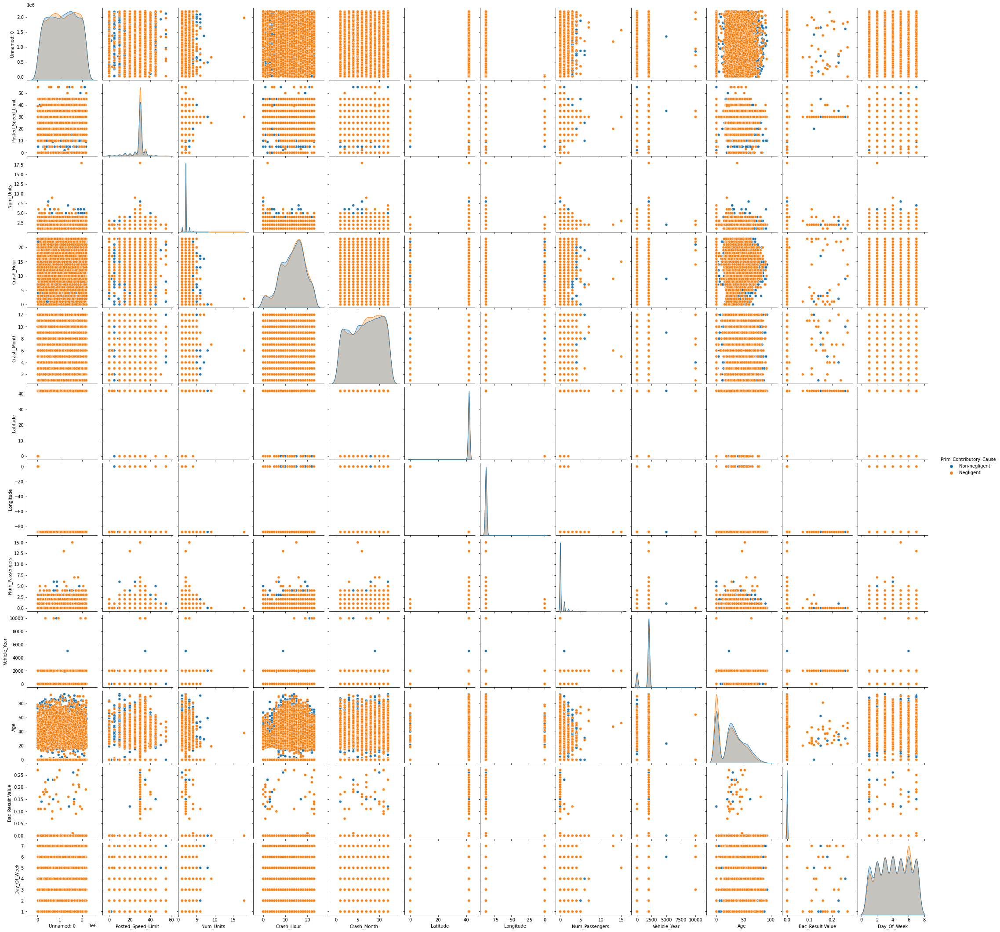
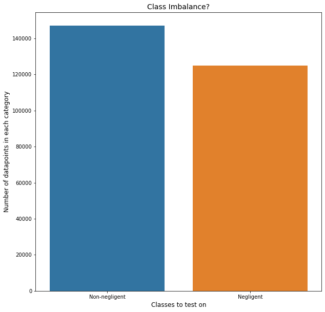

# Module 3 Final Project: Classification of the Chicago Car Crash dataset:

## Contents:
The contents of this repository are:
 - Data: The folder that holds all my data that I have used.
 - OSEMN: The Jupyter notebook that has my all my code.
 - Presentation: Pdf of project

## Project goals:
   - my objective of this project is to classify and find out whether the drivers are at fault for causing an accident or not.
   - I will be using a random forest classifier that will identify if the cause of the accident was caused from driver negligence or not.
    
## Method:
- Pulling the information needed from the Chicago Open Data Portal
- Binned the Primary Contributory Causes into negligent and non negligent classes
- I will be getting the full data from the Chicago open data portal and performing EDA as well as sampling the results that come out of the EDA.
- Fitting the data to a Random Tree Classifier after splitting the data into training and testing data at a 80/20 split
- Perform hyperparameter tuning using RandomSearchCV and GridSearchCV

# O- Obtain:
I obtained my data from this site: 
- Crashes: https://data.cityofchicago.org/Transportation/Traffic-Crashes-Crashes/85ca-t3if
- People: https://data.cityofchicago.org/Transportation/Traffic-Crashes-People/u6pd-qa9d
- Vehicles: https://data.cityofchicago.org/Transportation/Traffic-Crashes-Vehicles/68nd-jvt3

S- Scrub:
After I grabbed all the data from the site I went ahead and took care of all the missing values by filling them in with 0's for the integers and floats, and I filled in the categoricals with 'Unknown'. Then I looked at the entire dataset and determined what was used for placeholders and had too many missing values that wouldn't be usefull for my model and removed those columns. after everything I was left with ~45 columns. I can't really do too much 

E - Explore:
After the scrubbing of the data I took a look at how the dataset was distributed and went a little bit into a few meaningful categories that I thought would be a major contributing factors in the crashes like age, day of the week and the time of the day. 

After that I took a look at our classes to see if there was an imbalance and there was.

